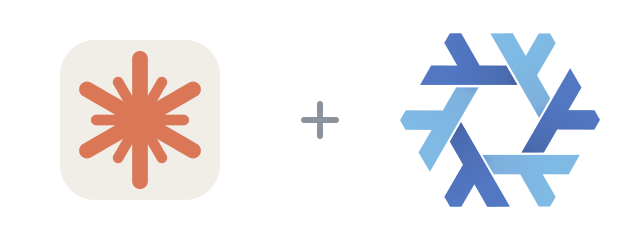

<p align="center">
  
</p>

<h1 align="center">claude-code-flake</h1>

<p align="center">
  <a href="flake.nix"></a>
  <a href="LICENSE"></a>
  <a href="https://github.com/anthropics/claude-code/blob/main/CHANGELOG.md"></a>
</p>

[Claude Code](https://github.com/anthropics/claude-code) is Anthropic's agentic coding tool for the terminal.

This flake packages Anthropic's official native build rather than the npm release, so there is no Node runtime and no `claude update` self-updater fighting the store. `ripgrep`, `procps`, and the sandbox helpers (`bubblewrap`, `socat`) are supplied declaratively. It supports x86_64 and ARM64 Linux.

```sh
nix run github:Fractal-Tess/claude-code-flake -- --version
```

Build it without running:

```sh
nix build github:Fractal-Tess/claude-code-flake#claude-code
```

## Install in a Nix configuration

Add the flake input:

```nix
inputs.claude-code-flake.url = "github:Fractal-Tess/claude-code-flake";
```

Use the NixOS module:

```nix
{
  imports = [ inputs.claude-code-flake.nixosModules.default ];
  programs.claude-code.enable = true;
}
```

Home Manager already ships a `programs.claude-code` module that manages settings, agents, commands, and MCP servers. Redeclaring those options here would collide, so this flake's Home Manager module only points that module at this package:

```nix
{
  imports = [ inputs.claude-code-flake.homeManagerModules.default ];
  programs.claude-code.enable = true;
}
```

The default overlay is available when you prefer `pkgs.claude-code`:

```nix
{
  nixpkgs.overlays = [ inputs.claude-code-flake.overlays.default ];
  environment.systemPackages = [ pkgs.claude-code ];
}
```

Claude Code is distributed under Anthropic's commercial terms, so the package is marked unfree. The flake evaluates its own nixpkgs with `allowUnfree` so `nix run` and `nix flake check` work directly; consuming it through `overlays.default` still requires `nixpkgs.config.allowUnfree = true` in your configuration.

Claude Code keeps its own settings, sessions, and projects under `~/.claude`; installing this package does not manage or migrate that data.

## Update

The daily [update workflow](.github/workflows/update.yml) runs at 12:00 UTC, fetches the latest release manifest with its per-platform checksums, validates the package, and commits an update. Run the same process locally with:

```sh
./scripts/update.sh
```

Pass a version such as `./scripts/update.sh 2.1.284` to pin a specific release. The workflow can also be started manually from GitHub Actions.

## Credits and mirrors

[GitHub](https://github.com/Fractal-Tess/claude-code-flake) · Gitadel: `ssh://git@neo.netbird.cloud:2222/fractal-tess/claude-code-flake.git`

The flake packaging is [MIT](LICENSE). Claude Code is proprietary software, © Anthropic PBC, and is governed by [Anthropic's Commercial Terms of Service](https://www.anthropic.com/legal/commercial-terms). The packaging approach follows the [nixpkgs `claude-code` derivation](https://github.com/NixOS/nixpkgs/tree/master/pkgs/by-name/cl/claude-code).

The lockup pairs a stylized burst drawn in Claude's orange — not an official Anthropic asset — with the [Nix snowflake](https://github.com/NixOS/nixos-artwork/tree/master/logo) by Simon Frankau and Tim Cuthbertson ([CC BY 4.0](https://creativecommons.org/licenses/by/4.0)), resized and arranged here. Anthropic is not affiliated with or endorsing this flake.
